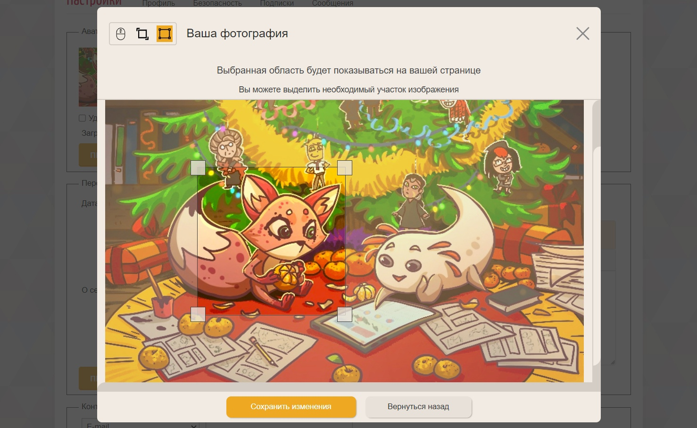

# Acomics Crop

Модуль обработки изображений перед загрузкой на сайт. При загрузке изображения с помощью элемента `<input type="file">` появляется всплывающее окно с возможностью кадрировать его. После кадрирования изображение также сжимается до необходимых размеров и только потом загружается.



## Демо

Работу модуля можно посмотреть [на демо-странице на GitHub Pages](https://mr9d.github.io/acomics-crop/demo/prod.html).

Также модуль работает при загрузке аватарки [в настройках профиля на портале Авторский Комикс](https://acomics.ru/settings/profile).

## Подключение на сайт

Добавьте в заголовочную часть HTML-страницы теги:

```html
<script defer src="https://cdn.jsdelivr.net/gh/mr9d/acomics-crop@master/versions/X.X.X/bundle.js"></script>
<link rel="stylesheet" href="https://cdn.jsdelivr.net/gh/mr9d/acomics-crop@master/versions/X.X.X/bundle.css">
```

где `X.X.X` - это номер версии. Доступные версии можно посмотреть [на этой странице](https://github.com/mr9d/acomics-crop/tree/master/versions).

Добавьте элемент для загрузки файла:

```html
<input type="file" class="imageResizeAndCrop" data-target-width="200" data-target-height="200">
```

где:
* `imageResizeAndCrop` - класс, по которому происходит инициализация модуля.
* `data-target-width` - требуемая ширина изображения.
* `data-target-height` - требуемая высота изображения.

## Локальный запуск

Предварительные требования:

* Node.js v20.13.1 или выше

Действия:

* Клонируйте репозиторий `git clone git@github.com:mr9d/acomics-crop.git`
* Перейдите в репозиторий с проектом `cd acomics-crop`
* Скачайте необходимые зависимости `npm ci`
* Соберите проект `npm run build`
* Откройте в браузере файл `demo/dev.html` из директории проекта

## Внести свой вклад

Если вы хотите помочь в разработке модуля, обратите внимание [на список открытых задач](https://github.com/mr9d/acomics-crop/issues).

Сделайте [форк](https://docs.github.com/en/pull-requests/collaborating-with-pull-requests/working-with-forks/fork-a-repo) чтобы работать в собственном репозитории, и [откройте пул-реквест](https://docs.github.com/en/pull-requests/collaborating-with-pull-requests/proposing-changes-to-your-work-with-pull-requests/about-pull-requests) с описанием изменений, которые вы сделали.

Не забудьте также проверить изменения через `npm run lint`.

## Используемые технологии

- HTML5/CSS3
- TypeScript 5.4.5 ([документация](https://www.typescriptlang.org/docs/))
- Webpack 5.91.0 ([документация](https://webpack.js.org/concepts/))
- ESLint 8.57.0 ([документация](https://eslint.org/docs/latest/))
- GitHub Pages ([документация](https://docs.github.com/en/pages))
- jsDelivr CDN ([о проекте](https://www.jsdelivr.com/about))
